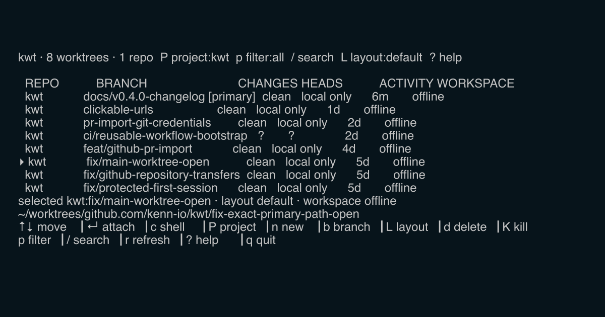

<section class="kwt-hero">
  <div class="kwt-hero__copy">
    <h1>One worktree per branch. One tmux session per worktree.</h1>
    <p class="kwt-hero__lede">
      kwt is a Git worktree manager with two surfaces. The dashboard is for
      you: see and manage the worktrees across all your projects from one
      keyboard-driven view. The CLI is for your coding agents: plain commands
      and stable JSON for creating worktrees and working inside their tmux
      sessions.
    </p>
    <div class="kwt-hero__actions">
      <a class="md-button md-button--primary" href="get-started/install/">Install kwt</a>
      <a class="md-button" href="get-started/quickstart/">Quickstart</a>
    </div>
  </div>
  <figure class="kwt-hero__preview">
    
  </figure>
</section>

## The dashboard, for you

```sh
go install go.kenn.io/kwt/cmd/kwt@latest
kwt
```

Run `kwt` inside a repository and it registers the project, discovers its
worktrees, and opens a full-screen dashboard. From one view you can:

- Attach to a worktree's tmux session (`enter`), creating it when needed.
- Create a branch and worktree (`n`), or search local and remote branches for
  one (`b`).
- See per-branch Git state — dirty, ahead, behind — across every project.
- Delete worktrees (`d`), kill live sessions (`K`), and switch the active
  project (`P`).

A plain directory can be a workspace too: run `kwt` there and `enter` opens a
tmux session in place. The [quickstart](get-started/quickstart.md) walks
through the full key map.

## The CLI, for your agents

Every dashboard operation is also a plain command, so coding agents and
scripts can manage worktrees and their bound tmux sessions without a UI:

```sh
kwt add -b feature/new-ui              # isolated checkout + tmux workspace
kwt exec feature/new-ui -- make test   # run a command in the worktree
cd "$(kwt get feature/new-ui)"         # resolve a worktree path
kwt list --json                        # machine-readable worktree state
kwt changes --json                     # exact changed-file snapshot
kwt remove -b feature/new-ui           # delete the worktree and its branch
```

`kwt pr import` checks a GitHub pull request out into a fresh worktree, and
`kwt status` shows which branches are dirty, ahead, or behind — useful when
several agents are working in parallel. `kwt changes [path]` inspects one exact
worktree when a script needs deterministic staged and working-tree file states.
Configurable
[layouts](workflows/agent-workspaces.md) define the tmux panes each workspace
starts with, from a single shell to a preset arrangement of agents.

## Guardrails

Checkouts of existing or remote branches are created inert: kwt skips
repository hooks, setup commands, and workspace launch until you review the
files and explicitly open the workspace. Pull-request imports use a protected
session boundary and preserve exact push routing. Multi-machine sync stays off
until you [configure it](multi-machine-sync.md).

<aside class="kwt-ecosystem">
  <div>
    <p class="kwt-eyebrow">Bundled by Ghosthub</p>
    <h2>The same worktree engine, inside a native terminal.</h2>
  </div>
  <div>
    <p>
      <a href="https://ghosthub.ai"><strong>Ghosthub</strong></a> bundles kwt
      to manage project registration, linked worktrees, pull-request imports,
      and canonical tmux sessions across local and SSH-hosted workspaces. Use
      Ghosthub for a native macOS experience or kwt directly from any supported
      terminal.
    </p>
    <a class="kwt-text-link" href="https://ghosthub.ai">Explore Ghosthub →</a>
  </div>
</aside>

<div class="kwt-link-grid">
  <a href="reference/cli/"><strong>CLI reference</strong><span>Commands, flags, JSON, and attachment contracts</span></a>
  <a href="reference/configuration/"><strong>Configuration</strong><span>Paths, layouts, agents, setup, and trust</span></a>
  <a href="reference/pull-requests/"><strong>Pull-request automation</strong><span>Discover, import, and attach safely</span></a>
  <a href="releases/"><strong>Releases</strong><span>Versions, artifacts, and upgrade guidance</span></a>
</div>
